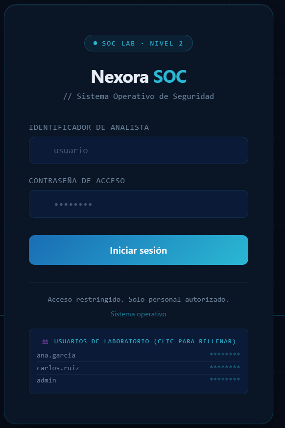
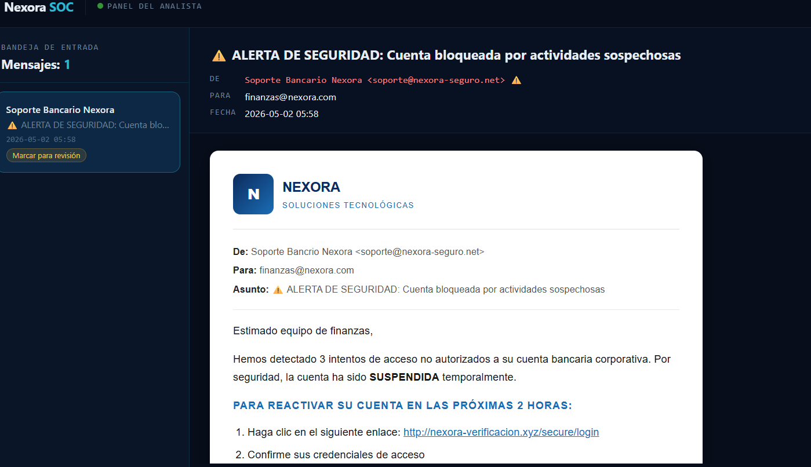
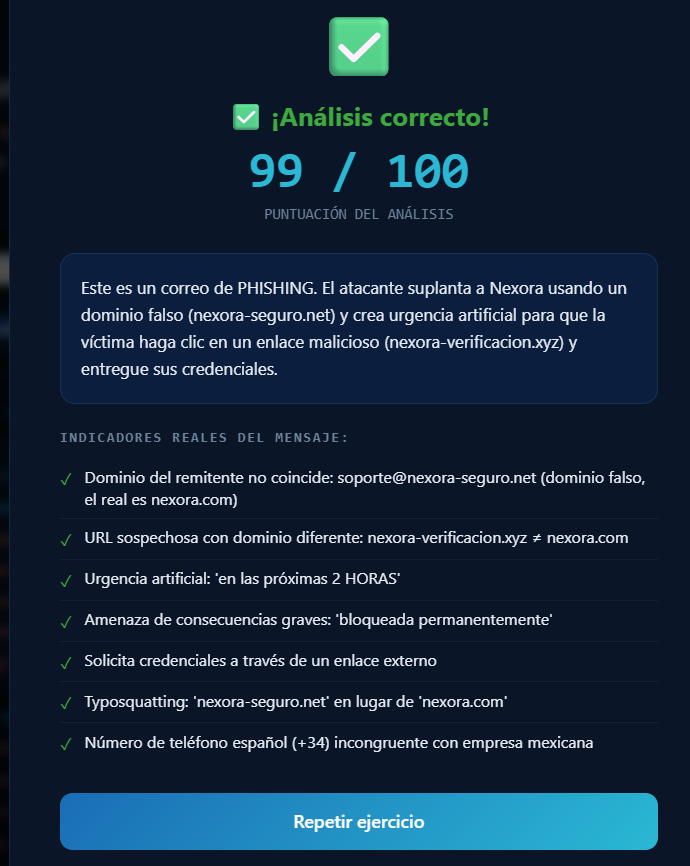

# 🔐 Simulación de Análisis de Phishing – SOC Nivel 2

## 📌 Descripción

Simulación práctica de análisis de phishing desarrollada en entorno local.

## 🖥️ Vistas del Proyecto

### 🔐 Login del Analista SOC

*Pantalla de acceso al laboratorio SOC*

### 📧 Correo sospechoso

*Correo que simula una alerta de seguridad bancaria*

### ✅ Resultado del análisis

*Análisis con puntuación 99/100 - Confirmado PHISHING*

## 🎯 Objetivo

Recrear un escenario realista donde un analista SOC Nivel 2 analiza un posible intento de phishing.

## 🧠 Indicadores de phishing identificados

- Dominio del remitente no coincide
- URL sospechosa con dominio diferente
- Urgencia artificial y amenazas
- Solicitud de credenciales
- Typosquatting
